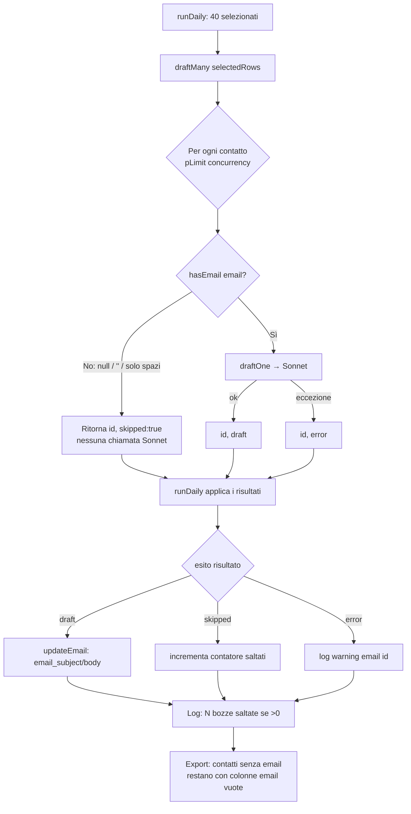

# Flow — Bozze email con guard "senza indirizzo"

Dettaglio del passo **bozze email** di `runDaily()` (`src/pipeline/run.ts`) dopo l'introduzione del
guard di costo: nessuna chiamata al modello Sonnet per i contatti privi di indirizzo email. È un
sotto-flusso del più ampio [[05-selection-email-export|Selezione → bozze → export]].

**Trigger:** `runDaily()` ha selezionato i 20+20 contatti del giorno e chiama
`draftMany(selectedRows)`. Vale identico sia da **CLI** (`src/cli.ts`) sia da **web UI**
(`src/server/run-daily-job.ts`): entrambi convergono su `runDaily` → `draftMany`, dove vive il guard.

**Attori:** `runDaily` (orchestratore), `draftMany`/`draftOne` (`src/email/draft.ts`), il predicato
[[presenza-email|`hasEmail`]] (`src/util/fields.ts`), il modello email **Sonnet**
(`config.emailModel`), la tabella `contacts` (SQLite).

## Passi

1. **`runDaily` → `draftMany(selectedRows)`** — i 40 selezionati del giorno entrano nel motore bozze.
2. **Per ogni contatto** (in `draftMany`, sotto `pLimit(config.scoringConcurrency)`), il guard valuta
   `hasEmail(contact.email)` **prima** di toccare il modello.
3. **Decisione `hasEmail`:**
   - **No** (email assente/vuota/solo spazi) → ritorna `{ id, skipped: true }`: **nessuna chiamata
     Sonnet**, nessuna spesa, **nessun errore** (non è un fallimento di pipeline).
   - **Sì** → `draftOne` chiama Sonnet → `{ id, draft }`; su eccezione, isolamento per-contatto →
     `{ id, error }` (gli altri proseguono).
4. **`runDaily` applica i risultati** in un unico passaggio sull'array `drafts`:
   - `draft` → `updateEmail(id, subject, body)`;
   - `skipped` → incrementa il contatore (nessuna scrittura, **nessun warning**);
   - altrimenti → `⚠️ email id=…: <error>`.
5. **Osservabilità:** se il contatore > 0, il run logga `→ N bozze saltate (contatto senza email,
   modello non chiamato).` — visibile su stdout (CLI) e nell'output catturato del job (UI).
6. **Esito terminale:** i contatti **senza** email restano in selezione e nell'export CSV/JSON con
   `email_subject`/`email_body` **vuoti** (stesso stato finale di una bozza fallita, ma senza spesa).
   Non vengono rimossi né riclassificati: la segmentazione è materia della spec
   [[../../../specs/lead-engine/email-segmentation-filters/SPEC|email-segmentation-filters]] (#3).

## [Source: IMPLEMENTATION-NOTES email-draft-guard]

- **Placement deliberato dentro `draftMany`**: chokepoint unico che copre CLI e UI; la garanzia
  "niente bozza senza email" è una proprietà del motore, non del chiamante.
- **Definizione di "senza email"**: `null` / `''` / solo whitespace (`hasEmail` = `typeof === 'string'
  && trim() !== ''`); nessuna validazione di sintassi. Vedi [[presenza-email]].
- **Conteggio single-pass**: il numero di saltati è accumulato nel loop di applicazione dei risultati
  (un solo passaggio sull'array), non con un secondo `.filter()`.
- **Verifica**: test hermetic su `draftMany` (mock di `@anthropic-ai/sdk`) prova che il modello è
  invocato **una sola volta** su un batch misto (solo il contatto con email). La stringa di log in
  `runDaily` è validata per ispezione (il run completo non è esercitabile offline).
