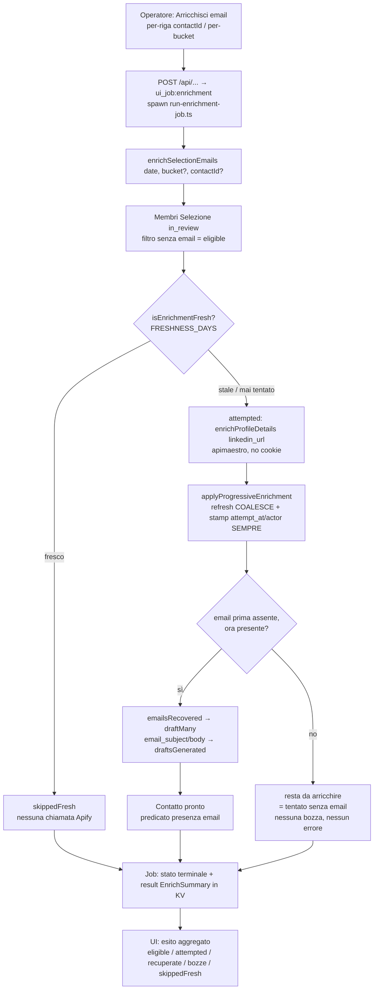

# Flow — Enrichment progressivo on-demand (recupero email → bozza → "pronto")

Azione **aggiuntiva** (modello "top-up") che dà al segmento "da arricchire" della Selezione una mossa
concreta: prova a recuperare l'**email mancante** di contatti già scored chiamando l'actor no-cookie
`apimaestro/linkedin-profile-detail`, e quando l'email compare genera subito la **bozza** così che il
contatto passi da "da arricchire" a "pronto" senza intervento manuale. Non ri-scora né ri-bucketizza
(Non-Goal): `bucket`/`sector`/`fit_score` restano quelli dello scoring originale. Affianca — non
sostituisce — l'enrichment batch `dev_fusion` del [[04-enrichment-scoring|run daily]]. Vedi
[[enrichment-progressivo-apimaestro]] per l'actor e [[presenza-email]] per il predicato di presenza email.

**Trigger:** dal segmento "da arricchire" della Selezione l'operatore lancia l'azione su **un singolo
contatto** (azione per-riga) o sull'**intero segmento di un bucket** (azione per-bucket). A trigger
manuale per ora (validazione umana); progettata per essere automatizzata in futuro senza riscritture.

**Attori:** la route Selezione (`web/src/routes/selections.$date.tsx`), l'endpoint Hono che avvia il job
(`src/server/app.ts`), il controller di job KV-based (`ui_job:enrichment`, `src/server/jobs.ts`), il
wrapper child-process (`src/server/run-enrichment-job.ts`, argv `[date, bucket?, contactId?]`),
l'orchestratore `enrichSelectionEmails` (`src/pipeline/enrich-selection.ts`), l'enricher
`enrichProfileDetails` (`src/enrich/profile-detail.ts`), la persistenza `applyProgressiveEnrichment` +
`isEnrichmentFresh` (`src/db/contacts.ts`), e `draftMany` (`src/email/draft.ts`).

## Passi

1. **Trigger e job.** L'operatore lancia l'azione dal segmento "da arricchire". L'endpoint avvia un
   **processo asincrono riusabile** con lo stesso meccanismo della pipeline (`ui_job:enrichment` in `kv`),
   spawnando `run-enrichment-job.ts` con argv `[date, bucket?, contactId?]`. L'operatore vede progresso ed
   esito in-app. Stesso pattern del run daily (job KV-based), non un meccanismo parallelo.
2. **Target = membri "da arricchire" di una Selezione _in revisione_.** `enrichSelectionEmails` interroga
   i membri della `daily_selection` in stato `in_review` (i contatti di una Selezione `exported` **non**
   sono mai bersaglio — vedi [[selezione-figlia-del-run]]), eventualmente ristretti a `bucket` o
   `contactId`, e tiene solo quelli **senza email** (`hasEmail` falso). Questo insieme è `eligible`.
3. **Gate di freshness (anti-spesa).** Per ogni eleggibile `isEnrichmentFresh(id, FRESHNESS_DAYS)` su
   `last_enrichment_attempt_at`: chi è stato tentato di recente è **saltato** (`skippedFresh`, nessuna
   chiamata Apify); i restanti (stale o mai tentati) sono i target `attempted`. Stessa logica `isFresh`
   dello scoring ma su un timestamp **dedicato** (`last_enrichment_attempt_at`, distinto da
   `last_evaluated_at`) per non conflare i due cicli.
4. **Chiamata all'actor (no cookie).** `enrichProfileDetails(targets.map(linkedin_url))` invoca
   `apimaestro/linkedin-profile-detail`, **una chiamata per URL** a concorrenza limitata, partendo dal
   `linkedin_url` salvato (incluso il formato URN `/in/ACwAAA…`). Dettagli su schema input e
   canonicalizzazione dell'output in [[enrichment-progressivo-apimaestro]].
5. **Persistenza status-preserving + stamp sempre.** `applyProgressiveEnrichment(id, enrichment ?? {},
   'apimaestro/linkedin-profile-detail')` scrive con semantica **refresh** (un valore nuovo non vuoto
   vince, COALESCE; un enrichment parziale non cancella dati noti) e **timbra sempre**
   `last_enrichment_attempt_at` + `last_enrichment_actor`, **anche sui miss** — è questo a distinguere
   "tentato senza email" da "mai tentato" ([[modello-stati-membership]], badge `ToEnrichBadge`). Non
   tocca `status` (resta `scored`).
6. **Bivio email.** Se l'azione recupera un'email per un contatto che **prima non l'aveva**
   (`emailsRecovered`), il contatto è ora "pronto" per il predicato di [[presenza-email|presenza email]].
   Se **non** la recupera, **resta** "da arricchire": nessuna bozza, nessun errore — solo lo stamp del
   tentativo.
7. **Bozza sui recuperati.** `draftMany` gira sui soli contatti con email appena recuperata (stesso
   percorso/prompt Sonnet, `EMAIL_SYSTEM`), popolando `email_subject`/`email_body` (`draftsGenerated`):
   di fatto **riapre** il guard di [[bozze-email-guard|email-draft-guard]] per quel contatto.
8. **Esito aggregato.** Il job scrive lo stato terminale con `result: EnrichSummary`
   (`eligible`, `attempted`, `emailsRecovered`, `draftsGenerated`, `skippedFresh`) in KV; la UI mostra
   tentati / email recuperate / bozze generate (pannello esito + toast).

**Esito terminale:** i contatti con email recuperata passano "da arricchire" → "pronto" **con bozza**;
i miss restano "da arricchire" ma marcati "tentato senza email" e non ri-tentabili finché il tentativo
non è stale; i freschi sono saltati senza spesa. Invarianti: l'azione opera **solo** su contatti senza
email, mai auto-parte, e un contatto riceve la cold-email al più una volta.

## [Source: SPEC + IMPLEMENTATION-NOTES progressive-enrichment]

- **Esecuzione (sequential):** grafo quasi lineare schema → modello → API → UI; l'enrichment vive in
  `enrichSelectionEmails` (T5), il job in `ui_job:enrichment` (T6), la persistenza in
  `applyProgressiveEnrichment` (T2).
- **R1 — smoke reale (2026-06-15), due difetti scoperti e corretti** girando il job vero (non solo la
  probe isolata) su 21 contatti "da arricchire":
  - **Fix 1 — schema di input** (`src/apify/actors.ts`, `profileDetailInput`): l'actor richiede
    `username` (accetta anche l'URL/URN) e `includeEmail: true` (default `false`); con l'input vecchio
    (`profileUrl`/`urls`) scrapava il profilo demo `sarptecimer` e non restituiva email.
  - **Fix 2 — chiave della mappa** (`src/enrich/profile-detail.ts`, `enrichProfileDetails`): l'actor
    **canonicalizza** l'URL in output (URN → public identifier), quindi la mappa va keyed sull'URL di
    **input**, altrimenti la lookup del chiamante (`enrichment.get(r.linkedin_url)`) falliva e
    **tutti** i risultati venivano scartati (`emailsRecovered: 0` pur con `attempted: 21`).
  - Dettagli del meccanismo in [[enrichment-progressivo-apimaestro]].
- **Esito end-to-end:** su 21 target, **7 email recuperate (33%)** → 7 bozze; la Selezione `2026-06-15`
  passa da `ready 1` a `ready 8`, `toEnrich 14`; i 14 miss restano "da arricchire" ma timbrati. Suite
  81/81 verde, typecheck pulito.
