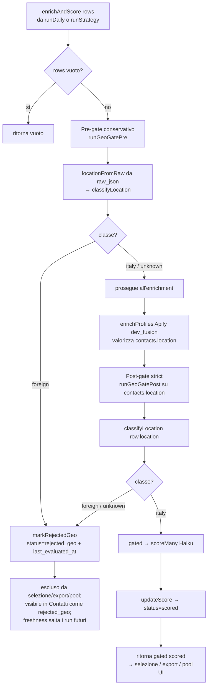

# Flow — Gate geografico Italia nel funnel

**Doppio gate geografico** dentro il chokepoint condiviso `enrichAndScore` (`src/pipeline/run.ts`):
scarta i profili LinkedIn fuori dall'Italia il prima possibile, su **tutti i bucket**, **forward-only**.
Il gate è il **controllo difensivo a valle** ("bretelle") che integra il pin `location:'Italy'` già
passato a harvestapi a monte ("cintura"): la people-search resta vincolata all'Italia, ma il filtro
dell'actor non è affidabile da solo (il bug osservato era un bucket azienda pieno di profili non
italiani). Tutta la logica decisionale vive nel modulo puro [[classificazione-geografica|geo-gate]];
i profili scartati diventano [[stato-rejected-geo|`rejected_geo`]] (tombstone). Non cambia
il [[04-enrichment-scoring|routing del bucket]] (resta di Claude), né scoring/selezione/export.

**Trigger:** `enrichAndScore(rows)` invocato dal funnel — sia [[01-architecture|`runDaily`]] (il run
20+20) sia `runStrategy` (run di confronto per singola strategia). Inserendo i gate nell'unico
chokepoint condiviso, entrambi i path li ereditano con una sola modifica.

**Attori:** la pipeline (`src/pipeline/run.ts`), il modulo `src/pipeline/geo-gate.ts`
(`runGeoGatePre`/`runGeoGatePost` → `applyGeoGate` → `classifyLocation`/`locationFromRaw`), il tombstone
DB `markRejectedGeo` (`src/db/contacts.ts`), l'enrichment Apify dev_fusion ([[04-enrichment-scoring]]),
lo scoring Haiku.

## Passi

1. **Guardia.** Se `rows` è vuoto, `enrichAndScore` ritorna subito `[]`.
2. **Pre-gate (conservativo) — `runGeoGatePre(rows)`**, **prima** di `enrichProfiles`. Per ogni riga la
   località si legge dal `raw_json` di people-search (`locationFromRaw`, path primario
   `location.linkedinText`) e si classifica. **Scarta solo con evidenza positiva di estero**
   (`classifyLocation === 'foreign'`); `italy` e `unknown` proseguono. È qui che si realizza il
   risparmio: i profili palesemente esteri (es. `"Cyprus"`) **non pagano l'enrichment Apify**, il costo
   dominante del funnel. `urls` è ricalcolato sulle righe filtrate; se restano zero righe si ritorna `[]`.
3. **Enrichment.** Solo i sopravvissuti passano a `enrichProfiles` (dev_fusion), che valorizza la colonna
   strutturata `contacts.location`.
4. **Post-gate (strict) — `runGeoGatePost(refreshed)`**, dopo `updateEnrichment` + `getByIds`. Ora la
   fonte autoritativa è `contacts.location`; `classifyLocation` decide e si **tiene solo `italy`**:
   `foreign` **e** `unknown` vengono scartati (lettura stretta di AC#1, "correttezza sul volume").
5. **Tombstone.** Ogni riga scartata (pre o post) passa per `markRejectedGeo(id)`: status terminale
   [[stato-rejected-geo|`rejected_geo`]] **+ stamp di `last_evaluated_at`**. Lo stamp è
   essenziale: la freshness esistente (`isFresh` + `FRESHNESS_DAYS`) fa sì che `persist` salti il profilo
   nei run futuri → niente ri-enrichment, niente ri-pagamento. Il conteggio è loggato
   (`→ geo-gate (pre|post): scartati N profili fuori Italia`) → calo di volume osservabile (AC#5).
6. **Scoring sui soli sopravvissuti.** `scoreMany(gated)` → `updateScore` porta a `status='scored'`. Solo
   profili italiani raggiungono `scored`.
7. **Esito terminale.** `enrichAndScore` ritorna `getByIds(gated.map(...)).filter(status==='scored')`.
   - `runDaily`: la selezione 20+20 interroga il DB (`selectBucket` richiede `status='scored'`) → i
     tombstone sono già esclusi per costruzione.
   - `runStrategy`: l'export usa il **valore di ritorno** (`gated`) → i tombstone non rientrano.
   - In entrambi i casi nessun `rejected_geo` compare in selezione, export CSV/JSON o pool candidati
     della UI (`/api/selections/:date/candidates`); compare solo nella lista Contatti come status
     osservabile (AC#4). Un profilo **basato in Italia ma con nome/nazionalità estera** è mantenuto: la
     classe guarda solo la stringa di località (AC#3).

**Fail-open (best-effort ovunque).** Il corpo di ciascun runner è in `try/catch`: se un passo lancia
(es. `markRejectedGeo`), il gate logga un warning e ritorna `rows` **intatte** — un errore del gate non
ferma mai il run. `classifyLocation`/`locationFromRaw` sono totali (non lanciano mai).

## [Source: SPEC + IMPLEMENTATION-NOTES italy-geo-gate]

- **Punto di inserimento (D6):** entrambi i gate dentro `enrichAndScore` (chokepoint condiviso) → coprono
  `runDaily` e `runStrategy` con una sola modifica.
- **Policy asimmetrica (D7):** pre = scarta solo `foreign` (non sprecare la chance di arricchire un
  `unknown` italiano); post = tiene solo `italy` (strict). Risolve la tensione AC#1 vs OQ#1.
- **Fix critico anti-leak:** il return finale di `enrichAndScore` usa `gated`, non `rows` — altrimenti i
  tombstone rientravano nell'export di `runStrategy` (violazione AC#1/AC#4). `runDaily` non usa il valore
  di ritorno (interroga il DB, già ripulito).
- **Pre-gate realizzabile (OQ#2):** confermato da payload reale — harvestapi profile-search "Short" espone
  la località come `location.linkedinText` (spesso il solo paese, es. `"Cyprus"`).
- **Nessun cambio schema:** `rejected_geo` è un nuovo *valore* dello `status` (colonna `TEXT`), non una
  colonna; osservabilità via log (D4), non via tabella `runs`.
- **Verifica:** logica decisionale coperta da unit test (`tests/italy-geo-gate.test.ts`, 28/28; suite
  intera 53/53, typecheck pulito). Il wiring di orchestrazione (chiama Apify/Anthropic) non è
  unit-testato, coerente col repo: verificato da typecheck + suite verde + lettura del flusso.
