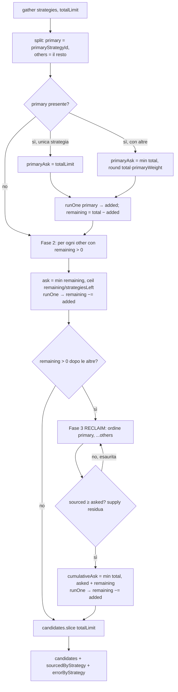

# Flow — Gather: primaria-first, budget dominante, riflusso, reclaim

Come `gather` (`src/pipeline/run.ts`) ripartisce `POOL_SIZE` tra le strategie dando **primazia** alla
fonte [[strategia-influencer-post-respondents]]: eseguita **per prima**, con quota **dominante**, ma con
il budget non consumato (volume basso) che **rifluisce** alle altre **senza ridurre il totale estratto**
(AC3). Tre fasi: primaria → residuo alle altre con carry-over → **reclaim** del budget orfano. Ogni
strategia è chiamata **una sola volta** sul path comune (no doppio costo API); il reclaim è una seconda
chiamata `source()` **bounded** che scatta solo quando il pool resta incompleto.

**Trigger:** `runDaily` (`gather(dailyStrategies(), POOL_SIZE)`) o `runStrategy` (`gather([strat], limit)`,
una sola strategia → niente split).

**Attori:** `gather` (`src/pipeline/run.ts`), `runOne` (closure che chiama `source`, deduplica per URL,
popola `sourcedByStrategy`/`errorByStrategy`/`askedByStrategy`); i knob `config.primaryStrategyId` e
`config.primaryWeight` (`src/config.ts`).

## Passi

1. **Split primaria / altre.** `primary` = la strategia con `id === config.primaryStrategyId`
   (`PRIMARY_STRATEGY_ID`, default `influencer-post-respondents`); `others` = tutte le altre attive.
2. **Fase 1 — primaria per prima, quota dominante.** Se la primaria è l'**unica** strategia (es.
   `runStrategy` sulla primaria) prende l'intero `totalLimit`, niente split. Altrimenti
   `primaryAsk = min(total, round(total · primaryWeight))` (`PRIMARY_WEIGHT`, default 0.5 → ~50% del
   pool come **cap**, non forzato). `runOne(primary, primaryAsk)` chiama `source` una volta, deduplica e
   ritorna gli **aggiunti reali**. `remaining = totalLimit − added` è calcolato sui candidati **realmente**
   resi, non sul cap: se la primaria rende poco, il residuo è grande e rifluisce.
3. **Fase 2 — le altre dividono il residuo (carry-over).** Per ogni `other`, finché `remaining > 0`:
   `ask = min(remaining, ceil(remaining / strategiesLeft))`. La quota è ricalcolata sul **residuo
   corrente** (non una quota pesata fissa), così ciò che la primaria non ha consumato rifluisce davvero;
   `remaining` scende degli **aggiunti reali** di ciascuna.
4. **Fase 3 — RECLAIM (chiude il BLOCKER under-fill).** Se dopo le altre `remaining > 0`, il budget
   riservato alla primaria per la diversità è rimasto **orfano** (le altre erano supply-thin) e il pool si
   riempirebbe **sotto** `min(Σ disponibili, POOL)`. In ordine (**primaria per prima**, poi le altre) si
   ri-chiede **solo** alle strategie che avevano reso almeno quanto chiesto (`sourced ≥ asked`, segnale di
   supply residua) il loro **target cumulativo** `min(total, asked + remaining)`. Seconda chiamata
   `source()` bounded (al più una per strategia); chi ha reso meno del richiesto è considerato esaurito e
   saltato.
5. **Chiusura.** Ritorna `candidates.slice(0, totalLimit)` più `sourcedByStrategy` (Σ grezzi visti) ed
   `errorByStrategy` (canale onestà): entrambi alimentano `logRun` e poi il report
   [[esito-strategia-onesto]].

**Esito terminale:** il pool è riempito fino a `min(Σ disponibili, POOL_SIZE)` con la primaria servita per
prima e dominante; quando la primaria è a basso volume (caso comune) la Fase 2 riempie già e la Fase 3 è
**saltata**.

> [!note] Reclaim su supply == ask — chiamata extra innocua
> Se una strategia rende **esattamente** quanto chiesto (nessun surplus reale), sul path di under-fill
> parte una `source()` extra che rende 0 (mai sul path comune a pool pieno). Tightening accettato come NIT
> dal gate — `tech-debt/lead-engine/influencer-post-respondents.md §1b`.

## [Source: SPEC + IMPLEMENTATION-NOTES influencer-post-respondents]

- **AC3 (met):** primaria eseguita per prima + budget dominante + riflusso, **+ reclaim** aggiunto post
  review per chiudere il BLOCKER di under-fill (`gather` lasciava il pool incompleto quando la primaria
  era supply-rich e le altre thin). 3 test di regressione aggiunti (T9).
- **Steering (2026-06-17):** l'adversarial-review (case B) ha trovato il BLOCKER under-fill → aggiunta la
  Fase 3 reclaim + ri-verifica → **SHIP**.
- **`primaryWeight = 0`** (anomalo): il floor `Math.max(1, ask)` in `runOne` garantisce comunque ≥1 alla
  primaria (primo claim garantito). Documentato come NIT (`§3`).
- **Riuso, non doppio costo:** una sola `source()` per strategia sul path comune; il reclaim è l'unica
  eccezione, bounded e condizionata a `remaining > 0`.
