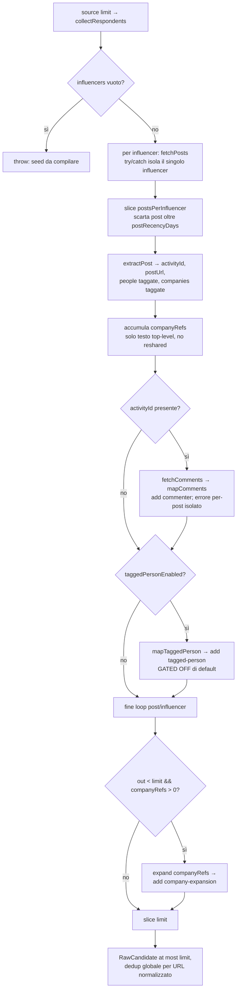

# Flow — Estrazione respondents (commentatori + taggati + espansione azienda)

Il core della fonte primaria [[strategia-influencer-post-respondents]]: da una lista di influencer
(`data/seeds/influencers.json`) ai candidati grezzi, dando la precedenza ai **commentatori** dei post
(segnale d'intento più caldo) e usando il budget residuo per **espandere le aziende taggate** a
decision-maker. L'orchestrazione (`collectRespondents`, `src/strategies/influencer-post-respondents.ts`)
è **pura rispetto all'I/O**: tutte le chiamate Apify passano da `deps` iniettabili (`fetchPosts`,
`fetchComments`, `expand`), così il core è testabile senza Apify (`tests/influencer-post-respondents.test.ts`).
L'attribuzione di ogni candidato per [[sotto-fonte-respondents]] (`commenter` / `tagged-person` /
`company-expansion`) nasce qui.

**Trigger:** `influencerPostRespondents.source(limit)`, chiamata da [[gather-primaria-budget-riflusso|gather]]
nel run giornaliero o in `runStrategy`.

**Attori:** `collectRespondents` (`src/strategies/influencer-post-respondents.ts`); i mapper puri
`extractPost` / `mapComments` / `mapTaggedPerson` (`src/strategies/post-extract.ts`); `expandCompanies`
(`src/strategies/company-expansion.ts`, vedi [[espansione-azienda-decisionmaker]]); gli actor apimaestro
`profile-posts` + `post-comments` e l'actor harvest `profile-search` (`src/apify/actors.ts`).

## Passi

1. **Guard del seed.** Se `deps.influencers` è vuoto, `collectRespondents` **lancia** subito: è un errore
   di configurazione (seed `influencers.json` da compilare), non un run pulito a 0. Distinto dal caso
   "girata e vuota" gestito a valle dal report ([[esito-strategia-onesto]]).
2. **Post per influencer, errore isolato.** Per ogni influencer `fetchPosts(url)` è in `try/catch`: un
   influencer che fallisce dà `posts = []` e **non** blocca gli altri. I post sono limitati a
   `postsPerInfluencer` (`POSTS_PER_INFLUENCER`, default 5).
3. **Filtro di recency.** Se `recencyCutoffMs` è impostato (`Date.now() - postRecencyDays·86_400_000`,
   default 90 giorni), i post con timestamp **anteriore** al cutoff sono saltati. Un post **senza** data
   leggibile **non** viene scartato (`postTimestamp → undefined` ⇒ passa).
4. **Estrazione dal post.** `extractPost(item)` ricava `activityId` (preferito `urn.activity_urn`, poi
   parsing di `full_urn`), `postUrl`, le **persone** taggate (`text_annotations[].type === 'profile'`,
   con `profile_urn`) e le **aziende** taggate (`type === 'company'`, con `company_urn`). Solo le
   annotation del **testo top-level**: quelle di `reshared_post` sono ignorate (D9, evita doppi conteggi).
5. **Accumulo delle aziende.** Le `companies` di ogni post sono accumulate in `companyRefs` per
   l'espansione finale (la dedup per azienda è a carico di `expand`).
6. **Commentatori (precedenza).** Se c'è un `activityId`, `fetchComments(activityId)` → `mapComments` →
   ogni autore valido diventa un `RawCandidate` con `sourceDetail = 'commenter'` (slug `/in/<slug>` reale
   da `author.profile_url`, `sourcePostUrl` valorizzato). I commentatori sono raccolti **per primi** così
   occupano il budget prima dell'espansione. Un errore di `fetchComments` su **questo** post è isolato
   (`catch` vuoto): contribuisce 0, non fa fallire `source()`.
7. **Persone taggate (gated-off).** Solo se `taggedPersonEnabled` (`TAGGED_PERSON_ENABLED`, **default
   `false`**): `mapTaggedPerson(p)` costruisce un URL dall'URN. ⚠ **blocked — risolvibilità URN non
   provata sull'enrichment daily** (`dev_fusion`): emissione disabilitata finché lo smoke reale (T14) non
   conferma. Vedi [[sotto-fonte-respondents]] e `tech-debt/lead-engine/influencer-post-respondents.md §1`.
8. **Espansione-azienda col residuo.** Dopo i loop, **solo se** `out.length < limit` **e** ci sono
   `companyRefs`, `deps.expand(companyRefs)` espande le aziende ai decision-maker (vedi
   [[espansione-azienda-decisionmaker]]). I commentatori hanno la precedenza: l'espansione riempie il
   budget rimasto.
9. **Dedup globale e limit.** Ogni `add()` deduplica per **URL LinkedIn normalizzato** (`seen` globale) e
   rispetta `limit` (smette di aggiungere a budget pieno). Il ritorno è `out.slice(0, limit)`.

**Esito terminale:** al più `limit` `RawCandidate` deduplicati, ciascuno attribuito a una sotto-fonte
(`commenter` / `tagged-person` / `company-expansion`). I candidati **non** sono ancora persistiti né
bucketizzati: il bucket lo decide Claude in scoring (doc [[04-enrichment-scoring]]), e la priorità
azienda agisce a valle in [[selezione-azienda-first]].

> [!warning] CONTRADICTS [[03-extraction-strategies]]
> La pagina di orientamento 03 descrive ancora `freelance-post-reactors` (reactors via `harvestapi`) come
> fonte dal seed `influencers.json`. Quella strategia è stata **rimossa** e sostituita da questa fonte
> (commentatori via apimaestro). Dove 03 e questo flow divergono, **vince il flow**.

## [Source: SPEC + IMPLEMENTATION-NOTES influencer-post-respondents]

- **AC1 (commentatori > 0):** mapper/orchestrazione/test verdi; la conferma reale (>0 commentatori su
  apimaestro) è demandata allo smoke T14 (manuale/paid, scrive su DB prod) — `pending live`.
- **AC2 (taggati persone+aziende):** **parziale**. Aziende → espansione **soddisfatta** (path harvest già
  validato). Persone taggate **gated-off** finché lo spike URN non passa (T5/T14).
- **D9:** ignorate le `text_annotations` del `reshared_post` (evita doppio conteggio e drift dell'autore
  originale).
- **Best-effort end-to-end:** influencer in errore → `[]`; commenti in errore su un post → 0 da quel post;
  nessun throw oltre al seed vuoto. Coerente col principio "best-effort ovunque" del dominio.
