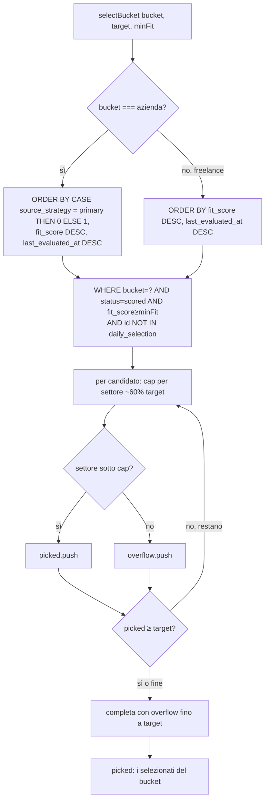

# Flow — Selezione azienda-first (priorità alla fonte primaria nel bucket azienda)

Come `selectBucket` (`src/pipeline/select.ts`) dà priorità ai candidati della fonte primaria
[[strategia-influencer-post-respondents]] **a parità di fit**, **solo** nel bucket **azienda** (AC4). È un
boost di **ordinamento** (chiave d'ordine leading), non un bypass: il cap per settore può comunque mandare
in overflow un candidato della primaria. Il bucket **freelance resta invariato**. Si innesta sulla
selezione "figlia del Run" già esistente ([[selezione-figlia-del-run]]): cambia solo l'`ORDER BY` del
bucket azienda.

**Trigger:** `runDaily` → `selectBucket('azienda', targetAzienda, minFitScore)` (e `selectBucket('freelance', …)`).

**Attori:** `selectBucket` (`src/pipeline/select.ts`); `config.primaryStrategyId` come parametro
dell'ordinamento; lo schema `contacts` (`source_strategy`, `fit_score`, `bucket`, `status`) e la membership
in `daily_selection`.

## Passi

1. **Eleggibilità invariata.** In entrambi i bucket i candidati sono i contatti `status = 'scored'`,
   `fit_score >= minFit`, **non già presenti in alcuna Selezione** (`id NOT IN (SELECT contact_id FROM
   daily_selection)`): la regola di membership di [[modello-stati-membership]] non cambia.
2. **Chiave d'ordine azienda-first.** Solo se `bucket === 'azienda'`, l'`ORDER BY` antepone
   `CASE WHEN source_strategy = primaryStrategyId THEN 0 ELSE 1 END` a `fit_score DESC, last_evaluated_at
   DESC`: a parità di fit, i candidati della primaria precedono gli altri. Per `freelance` l'ordine è il
   precedente (`fit_score DESC, last_evaluated_at DESC`), **immutato**.
3. **Boost dentro l'ordinamento, non un bypass.** Il boost agisce sull'ordine, poi interviene il **cap per
   settore** (`max(1, ceil(target · 0.6))`, ~60% del target da un singolo settore): un candidato della
   primaria oltre il cap del suo settore finisce comunque in `overflow`. La priorità è "a parità di fit",
   non assoluta.
4. **Riempimento con overflow.** Se dopo la passata con cap `picked` non ha raggiunto `target`, si completa
   pescando dall'`overflow` (sempre fino a `target`). Garantisce che il cap non lasci il bucket
   sotto-pieno quando mancano alternative.

**Esito terminale:** il bucket azienda dei `target` selezionati privilegia, a fit pari, i decision-maker e
i commentatori della fonte primaria; il bucket freelance è invariato. Il bucket finale di ciascun contatto
resta deciso da Claude in scoring (la strategia non lo impone): l'`ORDER BY` opera **dopo** la
classificazione.

## [Source: SPEC + IMPLEMENTATION-NOTES influencer-post-respondents]

- **AC4 (met):** "a parità di fit, in bucket azienda i candidati di questa fonte sono selezionati prima";
  verificato dal gate adversarial-review (verifier v3 → SHIP).
- **Scope chirurgico:** la modifica tocca **solo** l'`ORDER BY` del ramo azienda; cap per settore,
  overflow, eleggibilità per membership e bucket freelance restano identici a [[selezione-figlia-del-run]].
- **Nessuna regressione (AC6):** selezione 20+20, gate geo e import esiti continuano a funzionare (suite
  131/131, verifier v6 → SHIP).
